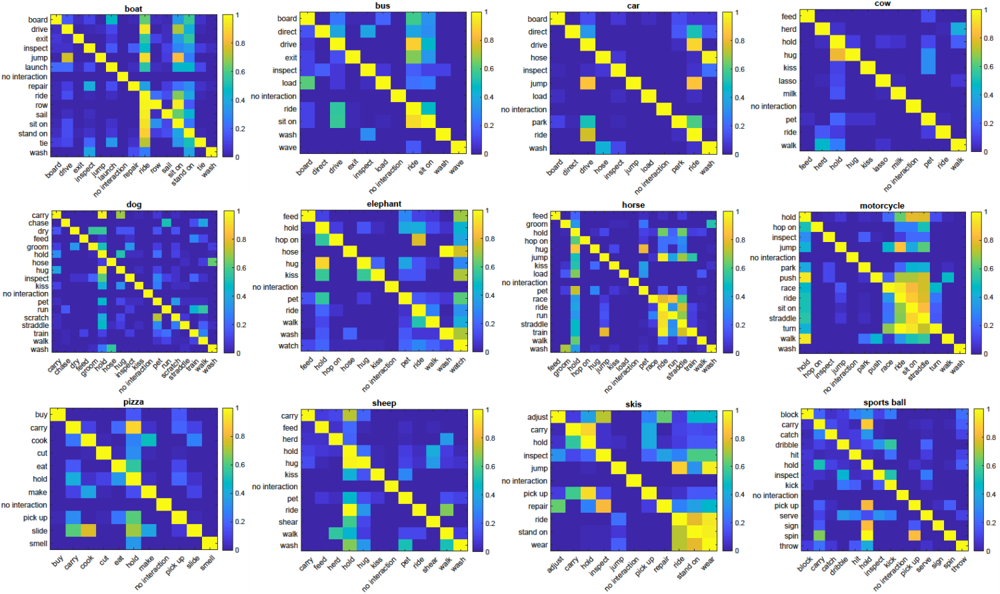

# Action Co-occurrence Priors


Official code for our ECCV paper,

**[Detecting Human-Object Interactions with Action Co-occurrence Priors](https://sites.google.com/view/action-cooccurrence)**.

Done by Dong-Jin Kim, Xiao Sun, Jinsoo Choi, Stehpen Lin, and In So Kweon.


We Introduce novel "action co-occurrence priors" to achieve state-of-the-art performance on Human-Object Interaction (HOI) detection task.


 The figure shows the marginal/conditional probability values computed from the distribution of the training label. Intuitively, detection of rarely labeled HOIs (operate-hair dryer) can be facilitated by detection of commonly co-occurring HOIs (hold-hair dryer). Also, non-detection of rare HOIs (blow-cake) can be aided by detection of incompatible HOIs (cut-cake). We leverage this intuition as a prior to learn an HOI detector effective on long-tailed datasets.




Examples of co-occurrence matrices constructed for several objects. Along the Y-axis is the given action, and the X-axis enumerates conditional actions. Each element represents the conditional probability that an action occurs when another action is happening.


# Requirements

Some of the codes are built upon No-Frills Human-Object Interaction Detection: Factorization, Layout Encodings, and Training Techniques [[website]](http://tanmaygupta.info/no_frills/). We appreciate them for their great work.

All dependencies will be installed in a python3 virtual environment. 

## Step 1: Create a python virtual environment

```
virtualenv -p python3.6 <path_to_new_virtual_env>
```

## Step 2: Activate the environment
```
source <path_to_new_virtual_env>/bin/activate
```

## Step 3: Install the dependencies

Here are the main requirements: 
- python 3.6.3
- pytorch 0.3.1
- numpy 1.14.2
- tqdm 4.23.0
- scipy 1.0.1
- scikit-image 0.13.1
- scikit-learn 0.19.1
- h5py 2.7.1
- plotly 2.5.1

Most of these can be installed with pip. There might be other dependencies which could be installed when prompted. Please check `pip_freeze_dump.txt` for version numbers before proceeding to install. Note that this txt file lists a lot more packages than needed (all packages installed in my virtual environment).  

**Important:** This repository supports Pytorch 0.3.1 and is not compatible with version 0.4 or higher because of various breaking changes introduced in these versions like unification of Tensor and Variable, Scalar Tensors etc. See [Pytorch Migration Guide](https://pytorch.org/blog/pytorch-0_4_0-migration-guide/) for details if you would like to port the implementation to a newer version of Pytorch. 

# Setup

We will be executing all commands inside the root directory (`.../ActionCooccurrencePriors/`) that was created when you cloned the repository. 

To begin, we will create a directory in the root directory called `data_symlinks` that would contain symlinks to any data to be used or produced by our code. Specifically we will create 3 symlinks:
- `hico_clean` -> directory where you downloaded HICO-Det dataset
- `hico_processed` -> directory where you want to store processed data required for training/evaluating models
- `hico_exp` -> directory where you want to store outputs of model training and evaluation

Creating these symlinks is useful if your hardware setup constrains where you keep your data. For example, if you want to store the dataset on the local drives, and code, processed files, and experiment data on the NFS to be shared across multiple servers


```
mkdir data_symlinks
cd data_symlinks
ln -s <path to hico_clean> ./hico_clean
ln -s <path to hico_processed> ./hico_processed
ln -s <path to hico_exp> ./hico_exp
```

If executed correctly, `ls -l data_symlinks` in the root directory should show something like:
```
hico_clean -> /data/tanmay/hico/hico_det_clean_20160224
hico_exp -> /home/nfs/tgupta6/Code/hoi_det_data/hico_exp
hico_processed -> /home/nfs/tgupta6/Code/hoi_det_data/hico_processed
```

# Download the HICO-Det dataset
We will now download the required data from the [HICO-Det website](http://www-personal.umich.edu/~ywchao/hico/) to `hico_clean`. Here are the links to all the files (version 0160224) you would need to download
- [Images and Annotations](https://drive.google.com/open?id=1QZcJmGVlF9f4h-XLWe9Gkmnmj2z1gSnk) (.tar.gz)
- [List of HOIs](https://drive.google.com/open?id=1ipvRTUF2zpOlHHqzbEb29iwscizoM1CK) (.txt)
- [List of Verbs](https://drive.google.com/open?id=1EeHNHuYyJI-qqDk_-5nay7Mb07tzZLsl) (.txt)
- [List of Objects](https://drive.google.com/open?id=1geCHW-yukOnEPjkiD9n9N5rWGczpzX4p) (.txt)

Extract the images and annotations file which will be download as a tar.gz file using
```
tar xvzf <path to tar.gz file> -C <path to hico_clean directory>
```
Here `-C` flag specifies the target location where the files will be extracted.

After this step output of `ls -l data_symlinks/hico_clean` should look like
```
anno_bbox.mat
anno.mat
hico_list_hoi.txt
hico_list_obj.txt
hico_list_vb.txt
images
README
tools
```
# Process HICO-Det files
The HICO-Det dataset consists of images and annotations stored in the form of .mat and .txt files. Run the following command to quickly convert this data into easy to understand json files which will be written to `hico_processed` directory
```
bash data/hico/process.sh
```
In addition, the `process.sh` performs the following functions:
- It calls `data/hico/split_ids.py` which separates sample ids into train, val, train_val (union of train and val), and test sets.
- It executes `data/hico/hoi_cls_count.py` which counts number of training samples for each HOI category

The splits are needed for both training and evaluation. Class counts are needed only for evaluation to compute mAP of group of HOI classes created based on number of available training examples.

# Run Object Detector (or download the detections we provide)

## Download

- Download [faster_rcnn_boxes.tar.gz](https://drive.google.com/file/d/1DdzvwSllYenT5Jt4DIu52mGG3uLgXX42/view?usp=sharing) to `hico_processed` directory
- Extract the file in the `hico_processed` directory
    ```
    cd <path to hico_processed>
    tar -xvzf faster_rcnn_boxes.tar.gz -C ./
    rm faster_rcnn_boxes.tar.gz
    cd <path to root>
    ```
- Write Faster-RCNN features to an hdf5 file
    ```
    python -m exp.hoi_classifier.data.write_faster_rcnn_feats_to_hdf5
    ```

# Run Human Pose Detector (or download the poses we provide)

## Download

- Download [human_pose.tar.gz](https://drive.google.com/file/d/1Y7NBgX8CeuAEqttUVRHJMb-9cXCJfIP6/view?usp=sharing) to `hico_processed` directory
- Extract the file in the `hico_processed` directory
    ```
    cd <path to hico_processed>
    tar -xvzf human_pose.tar.gz -C ./
    rm human_pose.tar.gz
    cd <path to root>
    ```

# Train HOI classifier

## Step 1: Generate HOI candidates from object candidates and cache Box and Pose features
We provide a simple bash script for this:
```
bash exp/hoi_classifier/scripts/preprocess.sh
```
This generates the following files in `hico_exp/hoi_candidates` directory:
- `hoi_candidates_<subset>.hdf5` : Box pair candidates. More details [here](docs/hoi_candidates.md)
- `hoi_candidate_labels_<subset>.hdf5` : Binary labels for hoi candidates to be used during training
- `hoi_candidates_box_feats_<subset>.hdf5` : Cached Box features
- `hoi_candidates_pose_<subset>.hdf5` : Pose keypoints assigned to human bounding boxes
- `hoi_candidates_pose_feats_<subset>.hdf5` : Cached Pose features

## Step 2: Train the model

Modify flags in `exp/hoi_classifier/scripts/train.sh` as required and run:
```
bash bash exp/hoi_classifier/scripts/train.sh <GPU ID>
```
`<GPU ID>` specifies the GPU to use for training the model.

This creates a directory called `factors_rcnn_det_prob_appearance_boxes_and_object_label_human_pose` in `hico_exp/hoi_classifier`. The name of the directory is automatically constructed based on the factors used in this model. The factors are enabled using appropriate flags in the `train.sh` file. 

This directory is used to store the following:
- constants needed for running the experiment
    - data paths (`data_train/val_constants.json`)
    - model hyperparameters (`model_constants.json` and `model.txt`) 
    - training hyperparameters (`exp_constants.json`) 
- tensorboard log files (`log/`)
- model checkpoints (`models/`)

### Time and Memory
- The full model achieves best val set performance in about 60000 iterations in ~12hrs (Nvidia K40 GPU)
- GPU memory usage is under 6 GB

# Evaluate Model

## Step 1: Select the model to evaluate

The model can be selected based on the validation loss logged in tensorboard and is usually around 60000 iterations. Let us call the selected iteration `<MODEL NUM>`

## Step 2: Make predictions for the test set

```
bash exp/hoi_classifier/scripts/eval.sh <GPU ID> <MODEL NUM>
```

This generates a `pred_hoi_dets.hdf5` file.

## Step 3: Compute mAPs

This is done by the `compute_map.sh` script in `exp/hico_eval` directory. Update variable `EXP_NAME` to the one you want to evaluate and `MODEL_NUM` to the selected `<MODEL NUM>` and run
```
bash exp/hico_eval/compute_map.sh
```
`EXP_NAME` defaults to `factors_rcnn_det_prob_appearance_boxes_and_object_label_human_pose` which is the model trained with all factors. The APs for each HOI category and overall performance are stored in the experiment directory with a relative path that looks like `mAP_eval/test_<MODEL NUM>/mAP.json`

The mAP for the provided model for various category groups (based on number of training samples) are as follows:

|Model|Full|Rare|Non-Rare|
|:-|:-:|:-:|:-:|
|HO-RCNN [1]|7.81|5.37|8.54|
|InteractNet [2]|9.94|7.16|10.77|
|GPNN [4]|13.11|9.34|14.23|
|iCAN [3]|14.84|10.45|16.15|
|Interactiveness Prior [5]|17.22|13.51|18.32|
|Contextual Attention [6]|16.24|11.16|17.75|
|No-Frills [7]|17.07|11.5|18.74|
|RPNN [8]|17.35|12.78|18.71|
|PMFNet [9]|17.46|15.65|18.00|
|**ACP**|**20.59**|**15.92**|**21.98**|

**References:**

[1] Chao, Y., Liu, Y., Liu, X., Zeng, H., & Deng, J. (2018). Learning to Detect Human-Object Interactions. 2018 IEEE Winter Conference on Applications of Computer Vision (WACV), 381-389.
[2] Gkioxari, G., Girshick, R.B., Dollár, P., & He, K. (2018). Detecting and Recognizing Human-Object Interactions. 2018 IEEE/CVF Conference on Computer Vision and Pattern Recognition, 8359-8367.
[3] Gao, C., Zou, Y., & Huang, J. (2018). iCAN: Instance-Centric Attention Network for Human-Object Interaction Detection. BMVC.
[4] Qi, S., Wang, W., Jia, B., Shen, J., & Zhu, S. (2018). Learning Human-Object Interactions by Graph Parsing Neural Networks. ECCV.
[5] Li, Y. L., Zhou, S., Huang, X., Xu, L., Ma, Z., Fang, H. S., ... & Lu, C. (2019). Transferable interactiveness knowledge for human-object interaction detection. CVPR.
[6] Wang, T., Anwer, R. M., Khan, M. H., Khan, F. S., Pang, Y., Shao, L., & Laaksonen, J. (2019). Deep contextual attention for human-object interaction detection. ICCV.
[7] Gupta, T., Schwing, A., & Hoiem, D. (2019). No-frills human-object interaction detection: Factorization, layout encodings, and training techniques. ICCV.
[8] Zhou, P., & Chi, M. (2019). Relation parsing neural network for human-object interaction detection. ICCV.
[9] Wan, B., Zhou, D., Liu, Y., Li, R., & He, X. (2019). Pose-aware multi-level feature network for human object interaction detection. ICCV.
